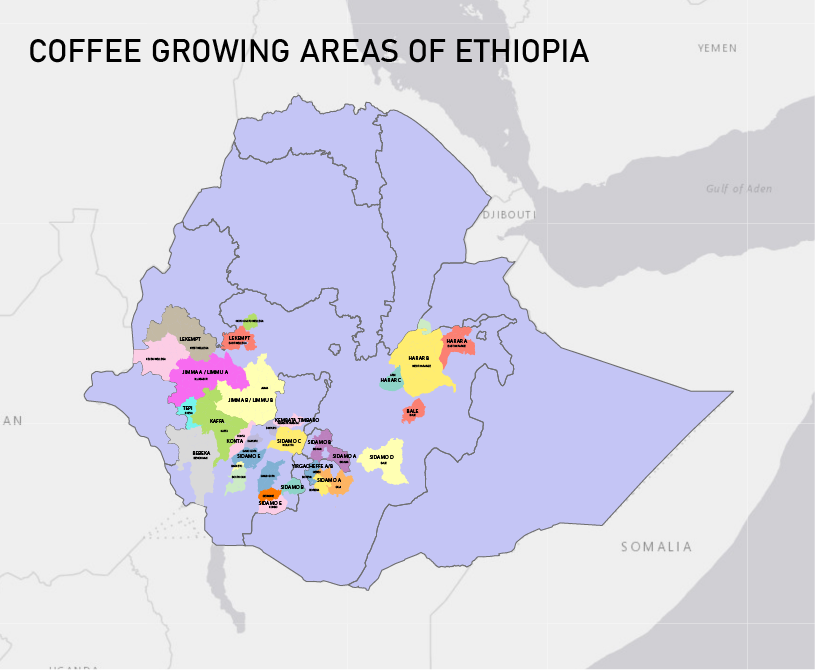

# Ethiopia Coffee Regions

Ethiopia's diverse highland geography — spanning east to west, south to north — creates strikingly different flavour profiles across its growing regions. Elevation, rainfall patterns, soil, and processing tradition all vary by region, making origin specificity essential when sourcing or tasting Ethiopian coffee. See ../Ethiopian Coffee/Ethiopia Coffee Articles/Ethiopia and Coffee for the full overview.

## [Ethiopian Southern Regions](../around-the-world/african-coffee/ethiopian-coffee/ethiopian-southern-regions.md)

### Yirgacheffe (Yirga Cheffe)

Ethiopia's most celebrated region, producing some of the most distinctive and sought-after coffees in the world.

- **Elevation:** 1,700–2,200 m (5,600–7,200 ft)
- **Character:** Floral, tea-like, citrus, bergamot
- **Processing:** Both washed and natural; both produce outstanding results
- **Profile:** Light body, complex acidity, highly aromatic
- **Sub-regions:** Kochere, Gedeb, Wonago — each with distinct character at lot level

### Sidama (Sidamo)

One of Ethiopia's largest growing regions with a broad flavour range.

- **Elevation:** 1,500–2,200 m (4,900–7,200 ft)
- **Character:** Bright acidity, berry notes, wine-like
- **Processing:** Predominantly natural process
- **Profile:** Medium body, fruity, complex

### Guji

An emerging region with some of Ethiopia's highest-quality lots in recent years.

- **Elevation:** 1,800–2,300 m (5,900–7,500 ft)
- **Character:** Blueberry, stone fruit, tropical fruit
- **Processing:** Natural and washed; outstanding naturals
- **Profile:** Full body, syrupy, intense fruit

---

## Ethiopian Western Regions

### Limu

- **Elevation:** 1,400–2,000 m (4,600–6,600 ft)
- **Character:** Balanced, wine-like, spice notes
- **Processing:** Mostly washed
- **Profile:** Medium body, moderate acidity; more subtle than southern regions

### Jimma

- **Elevation:** 1,400–2,000 m (4,600–6,600 ft)
- **Character:** Full-bodied, wine-like
- **Processing:** Natural and washed
- **Profile:** Heavy body, lower acidity; large production volume with variable quality

### Kaffa

The original birthplace of coffee. Home to wild coffee forests and the genetic source of the Gesha/Geisha variety.

- **Elevation:** 1,500–2,100 m (4,900–6,900 ft)
- **Character:** Wild, diverse, complex
- **Processing:** Natural, semi-washed
- **Profile:** Variable, often rustic

---

## Ethiopian Eastern Regions

### Harrar (Harar)

One of the oldest coffee-growing regions in the world, with a completely distinct dry-climate character.

- **Elevation:** 1,400–2,100 m (4,600–6,900 ft)
- **Character:** Wild blueberry, wine-like, earthy
- **Processing:** Natural (dry) process exclusively — no washed Harrar exists
- **Profile:** Heavy body, distinctive fermented character; sometimes called "Mocha Harrar"

---

## Region Comparison at a Glance

| Region | Elevation | Character | Primary Process |
|---|---|---|---|
| Yirgacheffe | 1,700–2,200 m | Floral, bergamot, tea-like | Both |
| Sidama | 1,500–2,200 m | Berry, wine-like | Natural |
| Guji | 1,800–2,300 m | Blueberry, tropical fruit | Both |
| Limu | 1,400–2,000 m | Balanced, spice | Washed |
| Jimma | 1,400–2,000 m | Full body, wine-like | Both |
| Kaffa | 1,500–2,100 m | Wild, complex | Natural |
| Harrar | 1,400–2,100 m | Wild blueberry, earthy | Natural only |

---

**Tags**: #ethiopia #origins #regions #yirgacheffe #sidama #guji #harrar #terroir

**Related MOCs**: ../Ethiopian Coffee/Ethiopia Coffee Articles/Ethiopia and Coffee | [Coffee Origins MOC](coffee-origins-moc.md) | ../Around the World/African Coffee/Africa in General/African Coffee Origins | Terroir in Coffee

---

Part of All-About-Coffee.com - The comprehensive coffee knowledgebase.

You can contact the editor:  
[matthewclairmont500@gmail.com](mailto:matthewclairmont500@gmail.com)

Copyright © All About Coffee 2026
