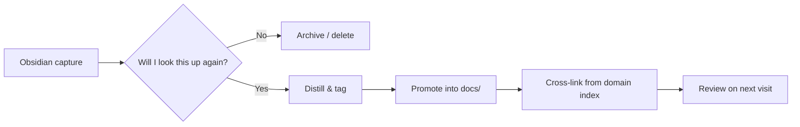

# Knowledge Architecture

The goal of this site is to be **the place I can trust to find the right answer fast**. To make that work, content has a predictable shape.

## Three content types

Every page belongs to one of three buckets. Pick the bucket *before* writing — it changes the structure.

Reference
:   Durable, distilled knowledge. Stable definitions, specs, cheat sheets. Optimized for scanning, not narrative.

How-to
:   Goal-oriented procedures. "If you need X, do Y." Each step verifiable. Optimized for execution under time pressure.

Notes
:   Working material — annotated reading, half-formed ideas, project logs. Optimized for capture speed. May graduate to *reference* or *how-to* later, or be archived.

!!! tip "Tag every page with its type"
    `tags: [reference]`, `tags: [how-to]`, or `tags: [notes]` — plus a domain tag like `coffee` or `traffic-ops`.

## Folder model

```
docs/
├── index.md                 # site landing
├── getting-started.md       # site usage
├── knowledge-architecture.md
├── coffee/
│   ├── index.md             # domain landing
│   ├── brewing/             # sub-domain
│   └── equipment/
└── traffic-operations/
    ├── index.md
    ├── signals/
    └── incident-management/
```

Each folder gets an `index.md` that:

1. Introduces the domain in one paragraph.
2. Lists the sub-domains with a one-line description each.
3. Highlights the 3–5 most-used pages in that domain.

## Tagging conventions

| Tag prefix       | Purpose                          | Example                          |
| ---------------- | -------------------------------- | -------------------------------- |
| Content type     | What kind of page is this        | `reference`, `how-to`, `notes`   |
| Domain           | Top-level subject area           | `coffee`, `traffic-ops`          |
| Sub-topic        | Optional finer slice             | `brewing`, `signals`, `incident` |
| Status (rare)    | Lifecycle hint, only when needed | `draft`, `deprecated`            |

Tags are flat strings in frontmatter — no hierarchy, no spaces, lowercase-with-hyphens.

## Lifecycle: from Obsidian to here



**Promotion criteria** — a note moves from the vault to this site only when:

- [ ] It's been useful at least **twice**.
- [ ] It can be read by future-me without the original context.
- [ ] All links resolve to either other pages here or stable external URLs.
- [ ] It has a content-type tag and a domain tag.

## Cross-linking

- Use **relative links** to other pages: `[V60 recipe](brewing/v60.md)`.
- Use **section anchors** for deep links: `[grind size](equipment/grinders.md#grind-size)`.
- Avoid linking to Obsidian-internal wiki-style `[[note]]` references — convert them on promotion.

## Review cadence

| Cadence       | Action                                                            |
| ------------- | ----------------------------------------------------------------- |
| On every edit | Verify front-matter, tags, and at least one inbound link.         |
| Monthly       | Skim the domain `index.md` pages — prune dead links, add new ones.|
| Quarterly     | Audit `notes`-tagged pages — promote, rewrite, or archive.        |
